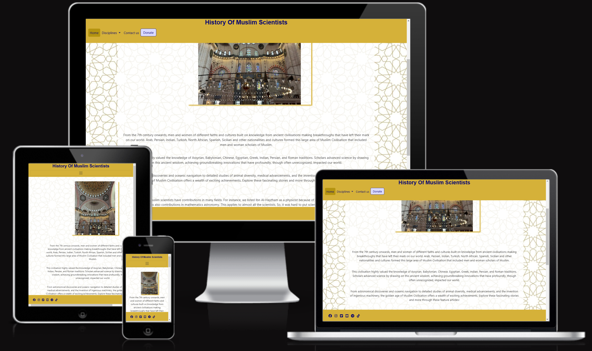
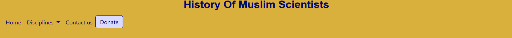

# The history of Muslim scientists

The History Of Muslim Scientists project is a website that will bring you back to the middle ages and give you a better idea on what the middle we like. The website present information about one of the most influential people in the history of science. Yes! in the history of science. What if I told you that the Americas were not first discovered by Christopher Colombus, or Isaak Newton was not the first to talk about the three laws of motion or fo you know the muslim mechanical engineer that Leonardo Devinci grow up learning from his books? It is ok if you do not know, that is why you have this website. This project is created mainly to shed light on these people and inform the public about who they are and what are their contribution. 
Moreover, it can be useful to wide range of people who may feel the need to know this information such as, science and theology students, muslims who wanted to know more about their heritage, newly convert who are curious to know about the contribution of muslim scientists and how religion was a fuel for these people to excel as religion require them to seek knowledge and learn science.  
 
This a picture that show how the website appears on multiple devices:  

  

## Features  
We have many features available for our users to make browsing the website easy and enjoyable.'

### Exising Features

- Navigation
    - It is located at the top of the page, The navigation bar shows the name of the site that can be clicked and take you to the home page.
    - There is also a home button to help you return to the home page.
    - The is a _disciplines_ section that helps you navigate the different disciplines we have on the site.
    - Since the middle ages were named the golden ages for muslim scientists we have chosen a golden color to be the primary color of the site and thus it was chosed as a background color for the navigation bar.
    - The bar also have a _contact us_ and a _donate_ links for you to contact us and to donate to our cause.
 

 

assets/readmeimages/header.png

