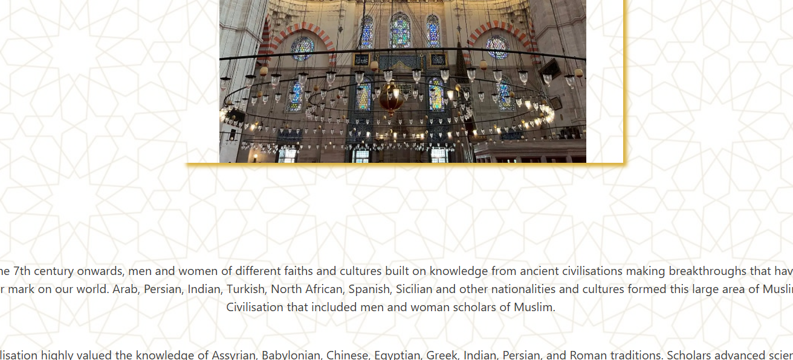
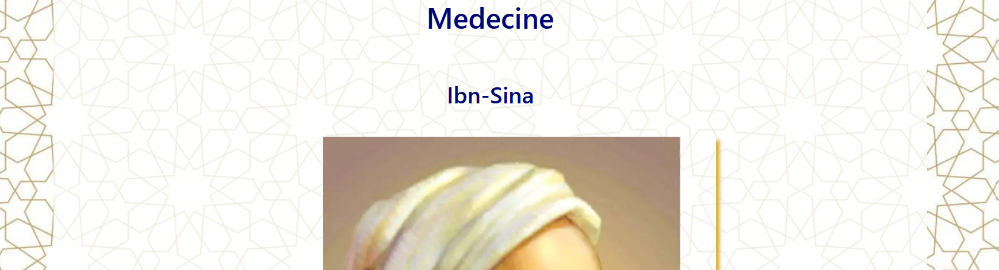

# The history of Muslim scientists
[View the live project here](https://ucusergit.github.io/project1/).
<br>

The History Of Muslim Scientists project is a website that will bring you back to the middle ages and give you a better idea on what the middle we like. The website present information about one of the most influential people in the history of science. Yes! in the history of science. What if I told you that the Americas were not first discovered by Christopher Colombus, or Isaak Newton was not the first to talk about the three laws of motion or fo you know the muslim mechanical engineer that Leonardo Devinci grow up learning from his books? It is ok if you do not know, that is why you have this website. This project is created mainly to shed light on these people and inform the public about who they are and what are their contribution.<br>
Moreover, it can be useful to wide range of people who may feel the need to know this information such as, science and theology students, muslims who wanted to know more about their heritage, newly convert who are curious to know about the contribution of muslim scientists and how religion was a fuel for these people to excel as religion require them to seek knowledge and learn science. <br>
<br>
This a picture that show how the website appears on multiple devices:<br><br>

<br><br>

## User Experience (UX)

* First time visitor Goals
    * I would like to see a website that easy to navigate both on my laptop and my phone
    Acceptance Criteria.
    * I want to quickly know the purpose of the site.
    * I want to see reliable information so that I can come back and use this website as a reference.

* Newly converted Goals
    * I want to learn more about the history of Muslim scientists and their contributions to science.
    * I want to learn about how this religion encourage people to pursue science and knowledge seeking.
    * I would like to proofs from the religious texts such as the Quran that talks about scientific facts.
    
* A Muslim Goals
    * As a muslim I want to learn more about my heritage.
    * I would like to improve my knowledge in general about the religious tests related to science.

* Philantropist Goals
    * As a Person who like to support various causes, I would like to have a support section where I can donate for this cause to develop the site and add more information to it.
    * I would like to see a list of non profit organizations on this site that I can potentially help.

* Students Goal
    * As a theology student, I am interested in learning about different religions.
    * As a theology student who is interested in history and religion, I would like to have a contact us page to inform the site of any discrepancies about the information available on the site.
    * As a science student, I am interested in learning about religion and how it is linked to science. I would like to know the scientific miracles in the Quran.
    * I would like to have a website with reliable information that I can use as a reference.

## Technologies Used

### Languages Used

* HTML5
* CSS

### Frameworks, Libraries & Programs Used
* Bootstrap 5.3:
    - Bootstrap was used to assist the responsiveness of the navigation and the grid system of the site.
* Hover.css:
    - It was used to create the hovering effect when passing the mouse over social media links and buttons.
* Google Fonts:
    - It was used to import 'Open-sans' and 'Montserrat' fonts into the style.css
* Font Awesome:
    - It was used to add social media icons to improve the user experience.
* Git:
    - It was used to for version control by utilizing the Gitpod terminal to Git and Push to Github.
* Github:
    - It was used to store the projects code and to track the project progress.
Balsamiq:
    - It was used as a wireframe to design the pages of the site.

## Features <br>
We have many features available for our users to make browsing the website easy and enjoyable.'

### Exising Features

- Navigation
    - It is located at the top of the page, The navigation bar shows the name of the site that can be clicked and take you to the home page.
    - There is also a home button to help you return to the home page.
    - The is a _disciplines_ section that helps you navigate the different disciplines we have on the site.
    - Since the middle ages were named the golden ages for muslim scientists we have chosen a golden color to be the primary color of the site and thus it was chosed as a background color for the navigation bar.
    - The bar also have a _contact us_ and a _donate_ links for you to contact us and to donate to our cause.


<br>

- The Header
    - The header shows a picture of a mosque. the mosque picture was taken by my friend Mr Naas who owns the right to the picture. The picture is the inside of a mosque in Turkey.
    - Under the picture there is a short description of the site and what it provides.


<br>

- Disciplines Sections
    - There are five disciplines on this site Mathematics, Physics, Chemistry, Medicine and Women in Science.
    - Each section shows multiple scientists in that field followed by an article that describes their life and their achievemnts. An example is shown in the folowwing pictures:





- Footer section
    - The footer also has a golden color background and it is at the bottom of the page.
    - It contains link to our social media platform for the users to connect with us and to learn more about the history of muslim scientists.


- Contact us section
    - The contact us section provide a way for website users to share their feedback and general questions with us.


- Donate section
    - This section is available so that our users can donate to our organisation to support our effort to spread the message and improve the site.
    - In the future, this section will also feature links to other organisations that support the goal so that our users can have many option to where they would like to donate.


## Features I would like to add

* More Disciplines
    * There are extra pages about Geography scientists, Explorers and philosophers.
    * The extra pages will provide information about scientists lives and their contributions.

* A page that provide the user with religious text that hold scientific miracles in the Quran.
* A page that provide religious text that encourages people to pursue science.
* A search field from Yamli.com button that help people to search the web in English and Arabic.
* A list of non-profit partners that support similar causes.

Note: The features were not added due to the short time available, however it is planned for the future so stay tuned.

## Testing

### General Testing

* I testesd this page on multiple browsers and it shows properly. I also added the css code to the _Autoprefixer_ website to add any vendor prefixes.
* I used the inspect function in Chrome to verify the responsiveness of the website on different screens.
* I tested all the links in the navigation page and they all work and connect to the other pages of the website. I also tested the external link and that they open on new tabs to improve the user experience.
* The donate form and the contact us form wor properly and their important field have to be filled before a submission is possible. Upon successfull completion, the user will be taken to a success pag to ensure the user that the form was submitted properly.
* I also tested the internal links from different pages to ensure that they all work.
<br>

### Testing User Stories from User Experience (UX) Section

* First time visitor Goals
    * The website is easy to navigate and has a clear navbar that shows clearly all the section of the website.
    * The website provides a paragraph on the front page that describes what the site is about.
    * The information provided on the site was taken from reliable sources.

* Newly converted Goals
    * The website separate the list of science by discipline and make it easy to find the discipline wanted. Also it provides a wide range of scientists for the user curiosity.
    * The website does not have a section for religious texts that encourage the pursue of science and it is planned in the future.
    * The website does not have a section for religious texts that show scientific miracles in the Quran and it is planned in the future.
    
* A Muslim Goals
    * Information about Muslim scientists is provided for muslims to learn about their heritage.
    * The website does not have a section for religious texts that show scientific miracles in the Quran and it is planned in the future.

* Philantropist Goals
    * Adonate page exists for donations.
    * The list of non profit organisations will be added in the future.

* Students Goal
    * Theology students have enough information to learn about the golden ages scientists.
    * The contact us page is available for theology students to contact us and share their feedback.
    * The website does not have a section for religious texts that show scientific miracles in the Quran and it is planned in the future.
    * The website information is reliable and was extracted from reliable sources.

## Bugs <br>

### solved bugs <br>

* When I deployed the project to Github Pages the background image did not show. I run multiple tests and finally found the issue. It was the path of the image. I added two dots in front of the path and the image was displayed.

 ```background-image: url('../images/background.jpg')```

* I also found another bug while testing for screen responsiveness. Although I used the media queries to adjust the width. It was not responsive and it did not behave as I wanted. After using the inspect tool and a consultation, I found that the problem was caused by the size of the images. I added a css styling to ensure that the images will also change size when the type of screen is changed. It fixed the problem.

* I had the anchor a inside a button which generated an error. Fixed the error by only using tag "a" to create the button and implemention a button type.

### Unsolved bugs

At the moment there are no unsolved bugs.

## Testing

* HTML validator

    * Fixed an error in the chemistry file as I used a ul inside a ul and it was supposed to be li for the list elements. Fixed the issue and no error were found after that.
    * In the contact page, I found an error in the input tag for message. I had to remove the required option and remove the placeholder and change the type to text. No errors were found after that.
    * In the donate page, I also changed the type of the message input to text. No errors were found after that.
    * In the index page, article tags were creating an issue as they require a heading. Removed the article tags and there were no errors after that.
    * In the mathematics page, I also removed the article tag and the there was no errors after that.

    

* CSS validator
    * There was no error in the CSS validator.

     

* Lghthouse tool (accessibility)

    This test was completed for all the pages and the results are below. One error appeared on all the tests and it is related to the antivirus I have on my laptop. It always include a javascript line in my code and I could not remove it. So, lighthouse finds it each time and give me an error of uhaving unused javascript. an image of that message will be provided.

    * <ins>Chemistry page</ins> <br>

     <br><br>
            
       - The results show 100% in accessibility so it has passed the test.

      <br><br>

       - This part of the test shows the potential savings that we can make in term of the time required to load the page. Lighthouse call it the render-blocking resources.
       - We cannot change those services as they are outside tools that were used to build the project so we do not have any control on how they are made. These include  _Googlefonts_ and _Bootstrap_, plus my Antivirus.

      <br><br>

       - "Enable text compression" This part of the result also include other potential savings and it is related to the antivirus.

      <br><br>

       - The "minify Javascript" is about the antivirus on my computer.
       - "Serve static assets" is about the images used. I already compressed all the images and used the webp version. Except for the background image. I found that the jpg format occupied less storage than the webp format so I used used the jpg format.
       - The "unused CSS" is for Fontawesome website.

    * <ins>Contact page</ins> <br>

       - The results were similar to previous page so we will not repeat the same the provided information. <br>

     <br>

    * <ins>Donate page</ins> <br>

       - The results were similar to previous page so we will not repeat the same the provided information. <br>

     <br>

    * <ins>Index page</ins> <br>

       - The results we similar except with the performance being only 96% here. This is die to the large image in the home page. An image of the message is added below. <br>

     <br>
     <br>

    * <ins>Mathematics page</ins> <br>

       - For the disciplines pages we will only run the mathematics page as they all have the same structure. <br>

     <br>

## Deployment <br>

### Github Pages
* The site was deployed to Github Pages following the steps below:
    * Log in to Github account, accessing project1 and navigate to settings.
    * Navigate to pages and change the branch to main and save.
    * The page will automatically refresh
    * Scrool again down and the Github Pages [link](https://ucusergit.github.io/project1/) will be on the first page on the right.

The deployed website can be found here: [The History of Muslim Scientists](https://ucusergit.github.io/project1/)
<br>

### Forking the Github Repository

It was not possible to fork the Github repository. The Fork button was inactive and a message was displayed that the forking is not possible because I own this repository and I am not a member of any organization.

## Credits

# Content

* I deas and pieces of code were taken from other sources.
* Used code from the walkthrough projects: [Love Running](https://github.com/ucusergit/running-club) and [Boardwalk Games](https://github.com/ucusergit/boardwalk-games) project. I did not use chunks of code but used lines of code to fix my table as I was not sure why it is not working. Added an extra “div” as it was used in the project to fix the issue. I also used ideas to how to present a list horizontally and how to style it to fit the website colors.
* Code was used from the [Boardwalk Games](https://github.com/ucusergit/boardwalk-games) project to style the social media icons and to add CSS variables.
* Code to make the grid was taken from the [Love Running](https://github.com/ucusergit/running-club) project.
* Used ideas from [Stack Overflow](https://stackoverflow.com/questions/51371994/box-shadow-on-image-using-html-vs-css) to add box-shadow to a picture to get rid of added space under the image. Space was added after I used object-fit attribute.
* Also used a line of code from website [shecodes.com]https://www.shecodes.io/athena/1057-troubleshooting-a-background-image-error-in-html to troubleshoot why the background image is not displayed.
* Used [w3schools.com](https://www.w3schools.com/cssref/playdemo.php?filename=playcss_justify-content) to find the proper attribute to use for styling the header and the footer.
* Used two lines of code from [digitaloceans.com](https://www.digitalocean.com/community/tutorials/ css-cropping-images-object-fit) to fix distorted images. They added a “box-shadow” and “object-fit” to the image styling.
* Used code from [Stack Overflow](https://stackoverflow.com/questions/44449372/override-bootstrap-important) to override bootstrap to set the background color for the navigation bar and the buttons and to remove the underline from text.
* Idea were used from [Stack Overflow](https://stackoverflow.com/questions/9222977/justify-text-in-css) to justify a text.

# Media

* The picture used on the main is from a friend of mine Mr. Naas.
* The pictures and content of this page was taken from the following resources: 
    * [Muslim Women Mathematicians website](https://muslimwomenmathematicians.org/Fatima.html)
    * [Mawdoo3.com](https://mawdoo3.com/%D9%85%D9%86_%D9%87%D9%88_%D8%AC%D8%A7%D8%A8%D8%B1_%D8%A8%D9%86_%D8%AD%D9%8A%D8%A7%D9%86) 
    * [1001inventions.com](https://www.1001inventions.com/) 
    * [trtworld.com - Al-Astrulabi](https://www.trtworld.com/magazine/mariam-al-astrulabi-a-muslim-woman-behind-the-10th-century-astrolabes-43479) 
    * [The Wikipedia page](https://ar.wikipedia.org/wiki/%D8%A3%D8%A8%D9%88_%D8%A8%D9%83%D8%B1_%D8%A7%D9%84%D8%B1%D8%A7%D8%B2%D9%8A) 
    * [Wikipedia - Al-Biruni](https://en.wikipedia.org/wiki/Al-Biruni) 
    * [Wikipedia - Al-Ghazali](https://en.wikipedia.org/wiki/Al-Ghazali) 
    * [Wikipedia - Khashkhash Ibn Saeed](https://en.wikipedia.org/wiki/Khashkhash_Ibn_Saeed_Ibn_Aswad) 
    * [pmc.ncbi.nlm.nih.gov](https://pmc.ncbi.nlm.nih.gov/articles/PMC2612469/) 
    * [trtworld.com](https://www.trtworld.com/magazine/mariam-al-astrulabi-a-muslim-woman-behind-the-10th-century-astrolabes-43479 
https://en.wikipedia.org/wiki/Muhammad_al-Idrisi) 

# Acknowledgements

* My mentor for continuous helpful feedback


